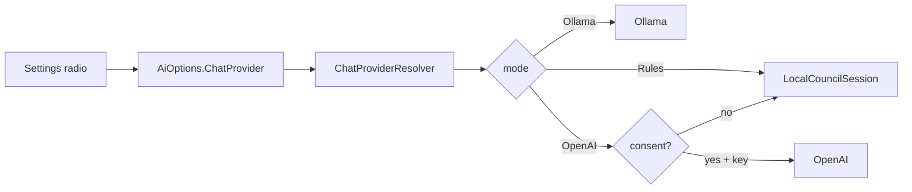
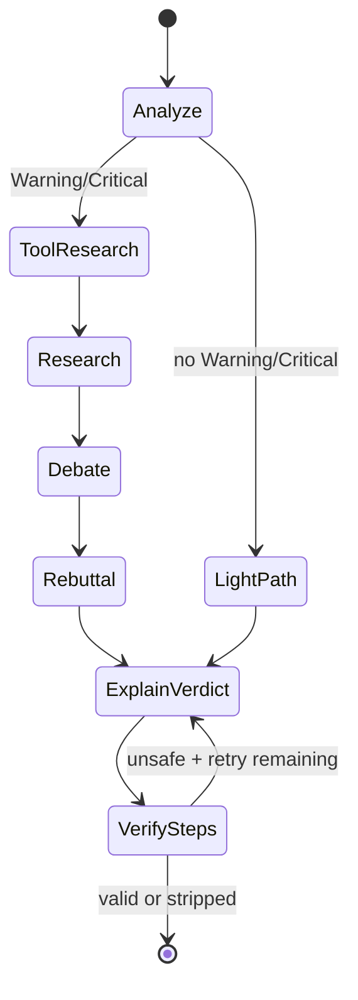

# AI Architecture — PatchGuard council stack

How optional AI guidance works: local RAG, provider routing, multi-agent graph, verification, and evaluation.

**Related:** [AI_ROADMAP.md](AI_ROADMAP.md) · [AI_EVAL_BASELINE.md](AI_EVAL_BASELINE.md) · [OLLAMA_SETUP.md](OLLAMA_SETUP.md) · [SPRINT_PLAN.md](SPRINT_PLAN.md)

**Last updated:** 2026-08-13 (Sprint 5)

---

## End-to-end flow

User completes a diagnostic scan → **Findings** → optional **AI guidance** → **RepairGuide** (steps, council transcript, provenance, agent trace).

```mermaid
flowchart TD
    subgraph UI["Guide + Settings UI"]
        GV[GuideViewModel]
        SV[SettingsViewModel]
        STORE[user-settings.json]
    end

    subgraph Core["AiCouncilService"]
        KB[KnowledgeRetrievalService]
        RES[ChatProviderResolver]
        RULES[LocalCouncilSession]
        GRAPH[CouncilAgentGraph]
        EVAL[CouncilEvaluationService]
    end

    subgraph Providers["IChatCompletionProvider"]
        OLL[OllamaChatProvider]
        OAI[OpenAiChatClient]
    end

    subgraph External["External — consent required"]
        TAV[TavilyWebSearchService]
    end

    SV -->|ChatProvider| STORE
    STORE -->|override AiOptions| RES
    GV -->|findings + consent flag| Core
    Core --> KB
    KB -->|KnowledgeHit[] hybrid| Core
    Core --> RES
    RES -->|null Rules| RULES
    RES -->|Ollama / OpenAI| GRAPH
    GRAPH -->|CouncilTrace + verified steps| RG[RepairGuide]
    GRAPH --> OLL
    GRAPH --> OAI
    Core -->|allowExternalServices| TAV
    TAV -->|WebSearchResult[]| Core
    RULES --> RG
    Core --> EVAL
    EVAL -->|CouncilEvaluationRecord| DB[(SQLite)]
    RG --> GV
```

**Privacy defaults**

- KB retrieval and Rules/Ollama run **without** external consent.
- OpenAI + Tavily require consent checkbox; payloads pass through `ExternalDiagnosticSanitizer`.
- Settings choice is local-only (`%LocalAppData%\PatchGuard\user-settings.json`).

---

## Settings — provider radio

Settings UI exposes **Cloud (OpenAI) / Ollama / Rules** (persisted). Runtime still honors per-request consent for Cloud.

| Mode | Resolves to | Leaves machine? | Consent |
|------|-------------|-----------------|---------|
| `Rules` | `null` → `LocalCouncilSession` | No | No |
| `Ollama` | `OllamaChatProvider` | No (localhost) | No |
| `OpenAI` (Cloud) | `OpenAiChatClient` | Yes | Yes |
| `Auto` (appsettings default) | OpenAI if key + consent, else Ollama if enabled, else Rules | Depends | For cloud |



Default local model: **`llama3.2:3b`** (~2 GB). See [OLLAMA_SETUP.md](OLLAMA_SETUP.md).

On LLM HTTP failure, `AiCouncilService` falls back to `LocalCouncilSession` (deterministic rules + KB).

---

## RAG — hybrid local knowledge base

Playbooks live in `PatchGuard/KnowledgeBase/Playbooks/*.md` (**15+** documents).

| Component | Role |
|-----------|------|
| `KnowledgeChunker` | Split markdown by headings |
| `HashingEmbeddingService` | Offline vector-like ranking (no cloud upload) |
| `KnowledgeRetrievalService` | Hybrid score = `0.65 * cosine + 0.35 * keyword overlap` |
| `KnowledgeReference` | Provenance in `RepairGuide` (playbook id, score) |

KB runs **before** council selection. Source label includes `+KB` when `GuidanceSource.KnowledgeBase` is present.

Keyword overlap uses alphanumeric tokens (length ≥ 2) from the query against title+content — exact tokens like `wuauserv` boost the matching playbook even when hashing embeddings are weak.

---

## Council backends

### Rules — `LocalCouncilSession`

Deterministic multi-phase simulation (Analysis → Research → Debate → Verdict) with fixed delays and template messages. No LLM. Always available offline.

### LLM — `CouncilAgentGraph`

Used when `ChatProviderResolver` returns Ollama or OpenAI. Conditional graph (LangGraph-style):



**Light path:** no Warning/Critical findings → skip tool research and debate rounds.

**Heavy path (~13 LLM calls + optional verify retry):** three debaters × (Analysis, Research, Debate, Rebuttal) + Chief JSON verdict.

**VerifySteps:** `FixStepVerifier` rejects privileged/destructive steps (DISM, SFC, registry, `sc`/`net` start/stop, unsafe `linkUrl`). Max **1** retry with rejection feedback; remaining unsafe steps are stripped.

Read-only Semantic Kernel tools (heavy path only):

- `query_knowledge_base`
- `get_local_status`

No write/admin tools — privileged fixes go through the guided-fix pipeline.

### Agent trace UI

`CouncilTrace` on `RepairGuide` records:

- nodes visited (`Analyze`, `ToolResearch`, …, `VerifySteps`)
- tools called
- per-node timing + total ms
- verify retry count

Guide shows a collapsible **Agent trace** expander after an LLM council run.

---

## Evaluation layer

| Piece | Purpose |
|-------|---------|
| `CouncilEvaluator` | Structural `ActionabilityScore` + `ConsistencyScore` on `RepairGuide` |
| `CouncilEvaluationService` | Persist aggregate row to SQLite (no PII, no raw prompts) |
| Golden fixtures | **15** JSON scenarios in `PatchGuard.Tests/Fixtures/GoldenScenarios/` |
| `GoldenScenarioTests` | Exact expected scores + **CI gate**: fail if averages drop **>5%** vs baseline (`94.4` / `96.7`) |

Eval `Source` labels: `Local`, `Local+KB`, `Ollama`, `Ollama+KB`, `AI`, `AI+KB`, `AI+Web`, etc.

---

## Key files

| Area | Path |
|------|------|
| Orchestrator | `PatchGuard/Services/Ai/AiCouncilService.cs` |
| Provider resolver | `PatchGuard/Services/Ai/ChatProviderResolver.cs` |
| Settings store | `PatchGuard/Services/Settings/JsonUserSettingsStore.cs` |
| Ollama | `PatchGuard/Services/Ai/OllamaChatProvider.cs` |
| OpenAI | `PatchGuard/Services/Ai/OpenAiChatClient.cs` |
| Rules council | `PatchGuard/Services/Ai/LocalCouncilSession.cs` |
| Agent graph | `PatchGuard/Services/Ai/CouncilAgentGraph.cs` |
| Step verify | `PatchGuard/Services/Ai/FixStepVerifier.cs` |
| Trace model | `PatchGuard/Models/CouncilTrace.cs` |
| RAG | `PatchGuard/Services/Ai/KnowledgeRetrievalService.cs` |
| Evaluator | `PatchGuard/Services/Ai/CouncilEvaluator.cs` |
| Agent prompts | `PatchGuard/Services/Ai/CouncilAgents.cs` |
| Sanitizer | `PatchGuard/Services/Ai/ExternalDiagnosticSanitizer.cs` |
| DI wiring | `PatchGuard/DependencyInjection.cs` |

---

## CI

GitHub Actions: `.github/workflows/ci.yml` — `dotnet build` + full test suite + explicit golden threshold filter on push/PR to `main`.

Ollama is **not** required in CI; provider tests use HTTP stubs.
