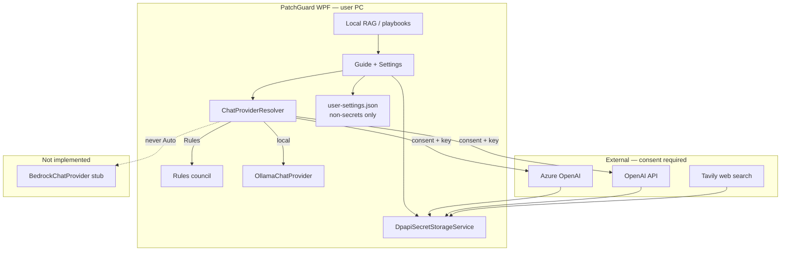

# Cloud Architecture — PatchGuard hybrid desktop

How optional cloud chat adapters fit a **local-first** Windows desktop app: Ollama/Rules stay on-box; Azure OpenAI and OpenAI leave the machine only with consent; secrets use DPAPI — not plain JSON.

**Related:** [AI_ARCHITECTURE.md](AI_ARCHITECTURE.md) · [AI_ROADMAP.md](AI_ROADMAP.md) · [SPRINT_PLAN.md](SPRINT_PLAN.md) · [OLLAMA_SETUP.md](OLLAMA_SETUP.md)

**Last updated:** 2026-08-14 (Sprint 6 + hardening)

---

## Hybrid desktop model

**Defaults**

| Path | Leaves machine? | Consent | Key storage |
|------|-----------------|---------|-------------|
| Rules | No | No | — |
| Ollama | No (loopback only) | No | — |
| OpenAI | Yes | Yes | DPAPI |
| Azure OpenAI | Yes | Yes | DPAPI |
| Bedrock | N/A | N/A | Stub only |

---

## Provider resolution

`Ai:ChatProvider` / Settings radio: `Auto` | `OpenAI` | `Azure` | `Ollama` | `Rules`.

**Auto order** (documented in `ChatProviderResolver`):

1. **Azure** — if endpoint + deployment + API key configured **and** Guide consent
2. **OpenAI** — if API key configured **and** consent
3. **Ollama** — if enabled (no consent)
4. **Rules** — deterministic local council (`null` provider)

AWS Bedrock is registered as a singleton stub (`IsAvailable = false`) and is **not** part of Auto.

---

## Azure OpenAI

| Setting | Source | Secret? |
|---------|--------|---------|
| Endpoint | `AzureOpenAI:Endpoint` / Settings / `user-settings.json` | No |
| Deployment | `AzureOpenAI:Deployment` / Settings / `user-settings.json` | No |
| API key | DPAPI (`azure-openai-api-key`) — migrated once from `AzureOpenAI:ApiKey` if present | **Yes** |
| API version | `AzureOpenAI:ApiVersion` (default `2024-06-01`) | No |

HTTP shape:

- `POST {endpoint}/openai/deployments/{deployment}/chat/completions?api-version=...`
- Header: `api-key: <key>` (not Bearer)
- Same chat message schema as OpenAI; deployment is in the path (no `model` body field)

Implementation: `AzureOpenAiChatProvider` → `IChatCompletionProvider`.

### Endpoint trust boundary

Azure endpoints are validated on every request via `TryNormalizeEndpoint`:

- **Scheme:** HTTPS only (HTTP rejected).
- **Host:** DNS name on an official Azure OpenAI suffix — `*.openai.azure.com` or `*.services.ai.azure.com`.
- **Rejected:** userinfo in URL, query/fragment, non-DNS hosts, private/custom domains.
- **Per-call:** the absolute request URI is rebuilt from current Settings/config each time — no stale cached base address after a settings change.

Ollama is restricted to **loopback** endpoints (`localhost`, `127.0.0.1`, `[::1]`). A remote `Ollama:BaseUrl` makes the provider unavailable even if `Ollama:Enabled` is true.

### HTTP response bounds

All chat providers (`OpenAiChatClient`, `AzureOpenAiChatProvider`, `OllamaChatProvider`) use:

- `HttpCompletionOption.ResponseHeadersRead` — headers checked before buffering the body.
- `BoundedHttpResponse` — shared **1 MB** cap; rejects oversized `Content-Length` and unknown-length streams that exceed the limit.

This limits memory exhaustion from hostile or misconfigured upstream responses.

### Manual smoke test (optional)

1. Create an Azure OpenAI resource + chat deployment.
2. Settings → **Azure OpenAI** → fill endpoint, deployment, paste key → **Save Azure settings**.
3. Confirm `%LocalAppData%\PatchGuard\secrets\azure-openai-api-key.bin` exists and is not readable plaintext.
4. Guide → enable external consent → run AI guidance.
5. Expect provenance **Azure OpenAI advice** and eval source label containing `Azure`.

---

## Secret storage (DPAPI)

| Item | Path |
|------|------|
| Interface | `ISecretStorageService` |
| Implementation | `DpapiSecretStorageService` — `ProtectedData` CurrentUser scope |
| Files | `%LocalAppData%\PatchGuard\secrets\*.bin` |
| Keys | `openai-api-key`, `azure-openai-api-key`, `websearch-api-key` |

**Bootstrap:** on startup, `SecretBootstrap.ApplySecrets` prefers DPAPI; if empty and `appsettings` still has a key, it migrates into DPAPI once. Clear keys from `appsettings.Development.json` after migrate so plaintext does not linger in the project tree.

`user-settings.json` stores **only** non-secrets (chat provider, Azure endpoint/deployment).

---

## Bedrock (honest scope)

`BedrockChatProvider` exists so the portfolio can show an AWS-shaped seam without claiming a working product integration.

- `IsAvailable` always `false`
- `CompleteAsync` throws `NotSupportedException` with a pointer to this doc
- Not selectable in Settings; not in Auto order

Shipping a real Bedrock adapter would need AWS credentials, region, model ID, and SigV4 — out of Sprint 6 scope.

---

## Privacy notes

- Cloud payloads still pass through `ExternalDiagnosticSanitizer` when consent is granted.
- Local KB indexing never uploads documents for embedding when using hashing embeddings.
- Privacy regression: `AiPrivacyAndProvenanceTests` must stay green.
