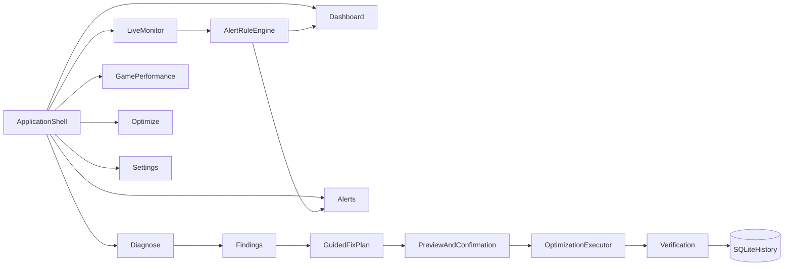

# PatchGuard UX and Feature Roadmap

**Branch:** `feature/ux-roadmap`  
**Last updated:** 2026-07-12

## Overview

Redesign PatchGuard around an accessible, task-oriented dashboard and a phased feature
roadmap for everyday Windows users and gamers. Establish consistent navigation,
reusable UI components, testing, and safety foundations before expanding alerts and
optimization capabilities.

## Phase status

| Phase | ID | Status |
|-------|-----|--------|
| 1 — UX foundation | `ux-foundation` | **Completed** |
| 2 — Unified diagnostic journey | `diagnostic-flow` | **Completed** (review fixes merged in this branch) |
| 3 — Guided fixes and alerts | `alerts-guided-fixes` | Pending |
| 4 — Optimization expansion | `optimization-expansion` | Pending |
| 5 — Supporting capabilities | `supporting-quality` | In progress (test project + security reviews started) |

## Product structure

- **Sidebar navigation:** Dashboard, Diagnose, Live Monitor, Game Performance, Optimize, Alerts, Settings.
- **Navigation stack:** Primary sections, nested diagnostic steps, back behavior, and active-section highlighting via `MainViewModel` + `NavigationService`.
- **Progressive disclosure:** Default screens use plain language, one primary action, optional technical detail.

## Phase 1: UX foundation (done)

- Design system in `Resources/Styles.xaml` — typography, spacing, colors, focus states, cards, buttons, status badges, keyboard focus.
- Reusable controls: `PageHeader`, `StatusSummaryCard`, `JourneyStepIndicator`.
- Dashboard (`HomeView`) — health summary, recommended actions, recent scans, live hardware snapshot, quick access tiles.
- Responsive layout constraints, automation names, WCAG AA contrast on primary buttons.

## Phase 2: Unified diagnostic journey (done)

### Journey flow

`Choose scan` → `Scan` → `Review findings` → `Optional AI guidance`

Persistent step indicator on Diagnose, Scan, Findings, and Guide views.

### Health scoring

- Single policy: `HealthScorePolicy` (`risk-capped-v1`).
- Per-module penalty cap (30), overall cap (80), risk-weighted severity.
- Persisted snapshots on `ScanRecord` (`HealthScore`, `ScorePolicyVersion`).
- Legacy DB rows backfilled on startup via `DatabaseSchemaInitializer`.

### Actionable findings

Each finding exposes: explanation, severity, evidence, recommended fix, action state,
admin requirement, risk, verification status.

### Optional AI guidance

- Explicit consent checkbox before any external AI/web call.
- Sanitized categories only (`ExternalDiagnosticSanitizer`); titles, paths, secrets omitted.
- Source provenance: Local / AI-generated / Web-sourced labels + inspectable references.
- Safe URLs: `ExternalUrlPolicy` (http/https for web), `LaunchUriPolicy` (http/https + `ms-settings:` for fix steps).
- External calls require configured provider **and** user consent.

### EF Core lifetime

- `IDbContextFactory<PatchGuardDbContext>` — no singleton `DbContext` on history services.

## Phase 3: Guided fixes and alerts (planned)

- Configurable CPU/GPU temperature and load alert thresholds.
- Alerts on Dashboard and Live Monitor with severity, timestamp, threshold, recommended action.
- Guided-fix pipeline: preview → confirm → execute → verify → record.
- No auto-run of privileged or destructive actions; cancellation, timeout, partial-failure reporting.

## Phase 4: Optimization expansion (planned)

- Reorganize Optimize into Safe Cleanup, Gaming Mode, Advanced.
- Harden cleanup with impact estimates, execution logs, verification, rollback where supported.
- Gaming Mode: temporary reversible changes with pre-state capture.
- Advanced tuning: individually explained opt-in actions only.

## Phase 5: Supporting capabilities (planned)

- Settings: alert thresholds, privacy/AI config, PresentMon path, appearance, elevation prefs.
- Secrets in Windows-protected storage (not plain JSON).
- Reopenable, comparable scan/optimization history.
- FPS setup improvements: dependency detection, setup guidance, benchmark sessions.

## Architecture



Views stay presentation-only. Navigation, scoring, alert evaluation, fix planning,
execution, and persistence live in testable services.

## Testing and security gates

**Test project:** `PatchGuard.Tests` (133 tests as of this branch).

Coverage includes:

- Navigation and UI contracts
- Health score policy boundaries
- History persistence and EF factory lifetime
- AI privacy, consent, URL policies, provenance
- Diagnostic metadata and orchestrator cancellation
- Update service health evaluation
- WPF smoke / journey tests

**Per-phase checklist:**

```powershell
dotnet build PatchGuard.slnx
dotnet test PatchGuard.Tests/PatchGuard.Tests.csproj
```

Manual smoke: keyboard navigation, small window, missing PresentMon, missing API keys,
denied UAC, scan/council cancellation, partial optimization failure.

**Security review areas:** input validation, elevation boundaries, secret handling,
command/path construction, filesystem cleanup boundaries, external link policy, AI
payload redaction, rollback integrity.

## Residual risks

- Transitive `SQLitePCLRaw.lib.e_sqlite3` 2.1.11 advisory (NU1903) — upgrade with EF bundle.
- Event log text stored locally in SQLite (by design; not sent externally without consent).
- Phases 3–5 placeholders (`AlertsViewModel`, `SettingsViewModel`, `PlannedFeatureView`) ship as stubs.
