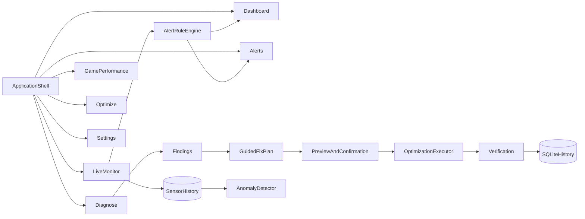

# PatchGuard UX and Feature Roadmap

**Branch:** `main`  
**Last updated:** 2026-08-13  
**Execution:** [SPRINT_PLAN.md](SPRINT_PLAN.md) — UX work spans Sprints 2–3 and 8.

## Overview

Task-oriented dashboard and phased feature roadmap for everyday Windows users and gamers.
AI competence phases (RAG, Ollama, Semantic Kernel, ML, Azure) live in [AI_ROADMAP.md](AI_ROADMAP.md).

## Phase status

| Phase | ID | Status | Sprint |
|-------|-----|--------|--------|
| 1 — UX foundation | `ux-foundation` | **Completed** | — |
| 2 — Unified diagnostic journey | `diagnostic-flow` | **Completed** | — |
| 3 — Guided fixes and alerts | `alerts-guided-fixes` | **Planned** | 2–3 |
| 4 — Optimization expansion | `optimization-expansion` | **Planned** | 8 |
| 5 — Supporting capabilities | `supporting-quality` | **Partial** (eval UI in Settings) | 5, 8 |

## Sprint mapping (product)

| Sprint | UX deliverables |
|--------|-----------------|
| **2** | `ISensorHistoryService`, `IAlertRuleEngine`, dashboard alert summary |
| **3** | Real Alerts UI, guided-fix pipeline (preview → confirm → execute → verify) |
| **8** | Optimize sections, Gaming Mode, full Settings, history compare, FPS setup UX |

## Phase 1: UX foundation (done)

- Design system in `Resources/Styles.xaml`
- Reusable controls: `PageHeader`, `StatusSummaryCard`, `JourneyStepIndicator`
- Dashboard with health summary, recent scans, live hardware snapshot

## Phase 2: Unified diagnostic journey (done)

- Flow: `Choose scan` → `Scan` → `Review findings` → `Optional AI guidance`
- `HealthScorePolicy` (`risk-capped-v1`) with persisted snapshots
- Actionable findings with evidence, risk, verification status
- AI: consent for external calls; Ollama + KB without consent; provenance labels
- `IDbContextFactory<PatchGuardDbContext>` for history services

## Phase 3: Guided fixes and alerts (Sprint 2–3)

- Configurable CPU/GPU temperature and load alert thresholds
- Alerts on Dashboard and Live Monitor
- Guided-fix pipeline: preview → confirm → execute → verify → record
- No auto-run of privileged or destructive actions

**Current gap:** Phase 3 delivered in Sprint 3 (`AlertsView` + guided-fix pipeline). Sensor history + `AlertRuleEngine` + dashboard alert summary shipped in Sprint 2.

## Phase 4: Optimization expansion (Sprint 8)

- Optimize sections: Safe Cleanup · Gaming Mode · Advanced
- Gaming Mode: reversible temp changes + pre-state capture
- Cleanup: impact estimates, logs, verification, rollback where supported

## Phase 5: Supporting capabilities (Sprint 5, 8)

- Settings: alert thresholds, provider radio (Cloud / Ollama / Rules), PresentMon path
- Secrets in Windows-protected storage (Sprint 6 for cloud keys)
- Scan history comparison UI
- FPS setup: dependency detection, guidance, benchmark sessions

**Today:** Settings shows council eval history only; chat provider is config-only (`appsettings`).

## Architecture


```mermaid
flowchart LR
    Shell[ApplicationShell] --> Dashboard
    Shell --> Diagnose
    Shell --> Monitor[LiveMonitor]
    Shell --> Performance[GamePerformance]
    Shell --> Optimize
    Shell --> Alerts
    Shell --> Settings
    Diagnose --> Findings
    Findings --> FixPlan[GuidedFixPlan]
    Monitor --> AlertRules[AlertRuleEngine]
    AlertRules --> Alerts
    AlertRules --> Dashboard
    Monitor --> SensorHistory[(SensorHistory)]
    SensorHistory --> MLAnomaly[AnomalyDetector]
    FixPlan --> SafetyGate[PreviewAndConfirmation]
    SafetyGate --> Executor[OptimizationExecutor]
    Executor --> Verification
    Verification --> History[(SQLiteHistory)]
```

## Testing and security gates

```powershell
dotnet build PatchGuard.slnx
dotnet test PatchGuard.Tests/PatchGuard.Tests.csproj
```

Per sprint: see verify commands in [SPRINT_PLAN.md](SPRINT_PLAN.md).

## Residual risks

- Transitive `SQLitePCLRaw.lib.e_sqlite3` 2.1.11 advisory (NU1903)
- Event log text stored locally in SQLite (by design)
- Alerts and parts of Optimize still stubbed until Sprints 2–3 and 8
